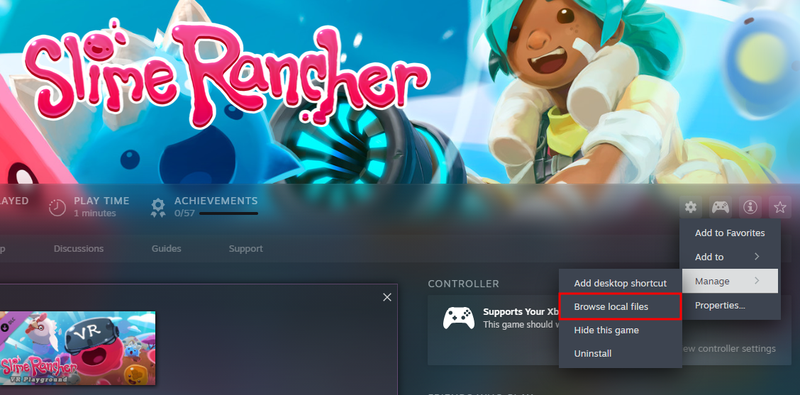

<!--

Hi! So I decided to rewrite the manual a little bit, this time in MarkDown format.
I knew from the start that putting the manual on github in md format was the better option, but I didn't.
Anyway, feel free to contribute to this manual I guess. I hope that this isn't too hard to work on!

- Zervó

-->

# SRMP Manual

This is a detailed manual for the Slime Rancher MultiPlayer mod (SRMP), it has installation instructions, compatibility information, usage instructions, troubleshooting steps and more. It is updated frequently to make it more readable and accurate. Now that it is on github, feel free to contribute! If this manual doesn't answer your questions or in case you don't understand something, feel free to ask in [Saty's Discord](https://discord.gg/NtB7baV).

## Content

Here is a list of content in this document.
Click a link to jump to that section of the document.

[What is SRMP?](#what-is-srmp)

[Compatibility](#compatibility)

[Download the mod](#download-the-mod)

> [Which version to use?](#which-version-to-use)

> [Download on Itch.io](#download-on-itchio-paid)

> [Download on Discord](#download-on-discord-free)

> [Download on GitHub](#download-on-github-free)

[Install the mod](#install-the-mod)

> [Windows](#windows)

> [Linux](#linux)

> [Mac](#mac)

[Using the mod](#using-the-mod)

> [Hosting and Joining](#hosting-and-joining)

> > [Hosting](#hosting)

> > [Joining](#joining)

> [Console commands](#console-commands)

[Troubleshooting](#troubleshooting)

[Credits](#credits)

## What is SRMP?

Slime Rancher MultiPlayer, or SRMP, is a mod developed by [Saty](https://github.com/SatyPardus) that adds multiplayer functionality to Slime Rancher. Development was abandoned at one point but was recently picked up again by [Twirlbug](https://github.com/Twirlbug) and then [PinkTarr](https://github.com/TheanMcGarity).

## Compatibility

SRMP works on all PC versions of the game except for the Microsoft Store version, so: Steam, Epic Games and GoG. Remember, this mod is for Slime Rancher 1, not 2! As Slime Rancher runs natively on windows, so will the mod. Both Slime Rancher and SRMP works on Windows, Linux and Mac. However getting Slime Rancher to work on the latter two may require additional steps, and there are some potential issues with the mod on those platforms that you may encounter (described in the Troubleshooting section). Below is a table to better visualize the platform compatibility for Slime Rancher + SRMP. Note: Table may currently be inaccurate as I don’t have enough data.

<!-- Only update this table if you have done enough testing to feel confident about your results, try not to provide inaccurate information. -->

|  compatibility  |     Windows     |      Linux      |       Mac       |      Other      |
| :-------------: | :-------------: | :-------------: | :-------------: | :-------------: |
|      Steam      |  🟢 Compatible  | 🟢 Compatible   | 🟢 Compatible   | 🔴 Incompatible.|
|   Epic Games    |  🟢 Compatible  | 🟢 Compatible   | ⚪ Unknown      | 🔴 Incompatible |
|       GoG       |  🟢 Compatible  | 🟡 Kinda works  | ⚪ Unknown      | 🔴 Incompatible |
| Microsoft Store | 🔴 Incompatible | 🔴 Incompatible | 🔴 Incompatible | 🔴 Incompatible |

Unknown just means that I didn't have enough data to say if the platform would work or not.

If you want an explanation to a specific entry in the table, select the operating system and platform below:

<!-- REMEMBER: If you updated the table above, also update the explanation below. -->

:window: Windows

    

        
- Steam

        🟢 Compatible: The game runs natively on Windows and Steam, no issues should be caused by this combination.
    

    

        
- Epic Games

        🟢 Compatible: The game runs natively on Windows and Epic Games, no issues should be caused by this combination.
    

    

        
- GoG

        🟢 Compatible: The game runs natively on Windows and GoG, no issues should be caused by this combination.
    

    

        
- Microsoft Store

        🔴 Incompatible: As with everything else from the Microsoft Store, this version of the game is scuffed.
    

:penguin: Linux

    

        
- Steam

        🟢 Compatible: By using proton and then installing the mod as you would on windows, you get the same performance and seemingly no issues. If the mod UI is missing text you need to install the ms arial font.
    

    

        
- Epic Games

        🟢 Compatible: So far only tested through Heroic Games Launcher as well as Lutris, but works just as well as native windows. If the mod UI is missing text you need to install the ms arial font.
    

    

        
- GoG

        🟡 Kinda works: I've only done minimal testing but from what the information I gathered there didn't seem to be any issues. Will still put this as Kinda works until I gather more data. If the mod UI is missing text you need to install the ms arial font.
    

    

        
- Microsoft Store

        🔴 Incompatible: Good luck getting Microsoft Store working on linux. Even if you did, this version doesn't work with the mod.
    

:apple: Mac

    

        
- Steam

        🟢 Compatible: Some people have gotten this to work by following the mac installation instructions in this documentation, but I don't know how well it works. If the mod UI is missing text you need to install the ms arial font.
    

    

        
- Epic Games

        ⚪ Unknown: Not tested (by the original manual author) yet. Not enough data to cover this entry.
    

    

        
- GoG

        ⚪ Unknown: Not tested (by the original manual author) yet. Not enough data to cover this entry.
    

    

        
- Microsoft Store

        🔴 Incompatible: Good luck getting Microsoft Store working on Mac. Even if you did, this version doesn't work with the mod.
    

### Playing with other mods

By using the SRML version of SRMP, it is possible to play with other mods. Keep in mind however, that SRMP has no official support for other mods and if you are experiencing issues with SRMP then removing other mods should be the first thing to try. Also, DO NOT place mods in the "Mods" folder when using the Standalone version of the mod, there will be problems. With that out of the way; below is a list of known compatible mods.

SRMP+SRML mod compatibility list

  
‎
**_This list may be outdated, it is currently based on information found [here](https://docs.google.com/document/d/1JsofvJNLPK5r3XIF-MHBLWBKDzB8GUmGcia9eVnYvJ4)._** I will update it with new information as I receive it. If you want to help, please follow the testing procedure described in the document I just linked. Feel free to give us any information you have to contribute with on discord, or contribute directly to this document if you feel comfortable doing that.

| Mod Name                                                                     | Compatible | Date Updated | Game Ver. | Mod Ver. | SRMP Ver. | Tested By  | Notes                     |
| :--------------------------------------------------------------------------- | :--------- | :----------: | :------: | :-------: | :-------: |:--------: | :------------------------- |
| [AshAndSteam](https://www.nexusmods.com/slimerancher/mods/101)               | 🔴 No      |   2022-?-?   | Unknown  |  Unknown  |  Unknown  | ClaraCrazy | duplicate key              |
| [BubbleSlimes](https://www.nexusmods.com/slimerancher/mods/100)              | 🟢 Yes     |   2022-?-?   | Unknown  |  Unknown  |  Unknown  | ClaraCrazy |                            |
| [Elemental Slimes](https://www.nexusmods.com/slimerancher/mods/129)          | 🔴 No      |   2022-?-?   | Unknown  |  Unknown  |  Unknown  | ClaraCrazy | duplicate key              |
| [FireSlimeFixes](https://www.nexusmods.com/slimerancher/mods/268)            | 🔴 No      |   2022-?-?   | Unknown  |  Unknown  |  Unknown  | ClaraCrazy | duplicate key              |
| [FrostysQuicksliverRancher](https://www.nexusmods.com/slimerancher/mods/130) | 🟢 Yes     |   2022-?-?   | Unknown  |  Unknown  |  Unknown  | ClaraCrazy |                            |
| [GemSlimes](https://www.nexusmods.com/slimerancher/mods/104)                 | 🔴 No      |   2022-?-?   | Unknown  |  Unknown  |  Unknown  | ClaraCrazy | duplicate key              |
| [ItemShop](https://www.nexusmods.com/slimerancher/mods/285)                  | 🟢 Yes     |   2022-?-?   | Unknown  |  Unknown  |  Unknown  | ClaraCrazy |                            |
| [KeepInventory](https://www.nexusmods.com/slimerancher/mods/305)             | 🟢 Yes     |   2022-?-?   | Unknown  |  Unknown  |  Unknown  | ClaraCrazy |                            |
| [Largo Fix](https://www.nexusmods.com/slimerancher/mods/132)                 | 🟢 Yes     |   2022-?-?   | Unknown  |  Unknown  |  Unknown  | ClaraCrazy |                            |
| [Largo Library](https://www.nexusmods.com/slimerancher/mods/105)             | 🟢 Yes     |   2022-?-?   | Unknown  |  Unknown  |  Unknown  | ClaraCrazy |                            |
| [LuckyPlorts](https://www.nexusmods.com/slimerancher/mods/65)                | 🟢 Yes     |   2022-?-?   | Unknown  |  Unknown  |  Unknown  | ClaraCrazy |                            |
| [MainMenuIsland](https://www.nexusmods.com/slimerancher/mods/184)            | 🟢 Yes     |   2022-?-?   | Unknown  |  Unknown  |  Unknown  | ClaraCrazy |                            |
| [MarketExpansion](https://www.nexusmods.com/slimerancher/mods/87)            | 🟢 Yes     |   2022-?-?   | Unknown  |  Unknown  |  Unknown  | ClaraCrazy |                            |
| [MemorizingFeeder](https://www.nexusmods.com/slimerancher/mods/311)          | 🟢 Yes     |   2022-?-?   | Unknown  |  Unknown  |  Unknown  | ClaraCrazy |                            |
| [MoreCorralUpgrades](https://www.nexusmods.com/slimerancher/mods/292)        | 🟡 Kinda   |  2024-12-02  |  1.4.4   |  Unknown  |  0.2.1c   |  Popommy   | causes desyncs (landplots) |
| [MoreGordos](https://www.nexusmods.com/slimerancher/mods/131)                | 🔴 No      |   2022-?-?   | Unknown  |  Unknown  |  Unknown  | ClaraCrazy | duplicate key              |
| [MoreTitles](https://www.nexusmods.com/slimerancher/mods/322)                | 🟢 Yes     |   2022-?-?   | Unknown  |  Unknown  |  Unknown  | ClaraCrazy |                            |
| [MoreVaccables](https://www.nexusmods.com/slimerancher/mods/4)               | 🟡 Kinda   |   2022-?-?   | Unknown  |  Unknown  |  Unknown  | ClaraCrazy | possible duping            |
| [MoreVaccablesPatch](https://www.nexusmods.com/slimerancher/mods/328)        | 🟡 Kinda   |   2022-?-?   | Unknown  |  Unknown  |  Unknown  | ClaraCrazy | possible duping            |
| [MoSecretStyles](https://www.nexusmods.com/slimerancher/mods/288)            | 🟢 Yes     |   2022-?-?   | Unknown  |  Unknown  |  Unknown  | ClaraCrazy |                            |
| [PowerVaccing](https://www.nexusmods.com/slimerancher/mods/289)              | 🟡 Kinda   |   2022-?-?   | Unknown  |  Unknown  |  Unknown  | ClaraCrazy | possible duping            |
| [SaberBlob](https://www.nexusmods.com/slimerancher/mods/323)                 | 🟢 Yes     |   2022-?-?   | Unknown  |  Unknown  |  Unknown  | ClaraCrazy |                            |
| [SecretStyleRemovalSafety](https://www.nexusmods.com/slimerancher/mods/288)  | 🟢 Yes     |   2022-?-?   | Unknown  |  Unknown  |  Unknown  | ClaraCrazy |                            |
| [SecretStyleThings](https://www.nexusmods.com/slimerancher/mods/249)         | 🟢 Yes     |   2022-?-?   | Unknown  |  Unknown  |  Unknown  | ClaraCrazy |                            |
| [ShinySlimes](https://www.nexusmods.com/slimerancher/mods/34)                | 🟢 Yes     |   2022-?-?   | Unknown  |  Unknown  |  Unknown  | ClaraCrazy |                            |
| [SingularitySlimes](https://www.nexusmods.com/slimerancher/mods/21)          | 🔴 No      |   2022-?-?   | Unknown  |  Unknown  |  Unknown  | ClaraCrazy | duplicate key              |
| [SlimePondUpgrades](https://www.nexusmods.com/slimerancher/mods/281)         | 🟢 Yes     |   2022-?-?   | Unknown  |  Unknown  |  Unknown  | ClaraCrazy |                            |
| [SlimeAndMarket](https://www.nexusmods.com/slimerancher/mods/118)            | 🟢 Yes     |   2022-?-?   | Unknown  |  Unknown  |  Unknown  | ClaraCrazy |                            |
| [SmartVacpack](https://www.nexusmods.com/slimerancher/mods/306)              | 🟡 Kinda   |   2022-?-?   | Unknown  |  Unknown  |  Unknown  | ClaraCrazy | possible duping            |
| [SplitterSlimes](https://www.nexusmods.com/slimerancher/mods/258)            | 🔴 No      |   2022-?-?   | Unknown  |  Unknown  |  Unknown  | ClaraCrazy | duplicate key              |
| [SRMLRegistryFixes](https://www.nexusmods.com/slimerancher/mods/236)         | 🟢 Yes     |   2022-?-?   | Unknown  |  Unknown  |  Unknown  | ClaraCrazy |                            |
| [UpgradeTabs](https://www.nexusmods.com/slimerancher/mods/309)               | 🟢 Yes     |   2022-?-?   | Unknown  |  Unknown  |  Unknown  | ClaraCrazy |                            |
| [ZoneUI](https://www.nexusmods.com/slimerancher/mods/167)                    | 🟡 Kinda   |   2022-?-?   | Unknown  |  Unknown  |  Unknown  | ClaraCrazy | doesn't show mod slimes    |
| [DimensionWarpSlimes](https://www.nexusmods.com/slimerancher/mods/301)       | 🟢 Yes     |   2022-?-?   | Unknown  |  Unknown  |  Unknown  | AceGalaxy  |                            |
| [ExtraVacSlots](https://www.nexusmods.com/slimerancher/mods/219)             | 🔴 No      |   2022-?-?   | Unknown  |  Unknown  |  Unknown  | ClaraCrazy | doesn't behave at all      |

NOTE: A mod being listed as compatible doesn't mean it will work well.

## Download the mod

The first step is to download the mod. There are multiple ways to do this, and there are multiple versions to choose from so here is a short explanation. The first alternative: purchasing the mod on itch.io, which supports Saty. The second alternative is Discord, and the third alternative is Github. Do not get the mod from other sources. Before downloading, find out which version you need below.

### Which version to use?

There are many versions and two different “types” of the mod. The latest recommended version of the mod will probably always be the latest github release. If you are unsure, the latest recommended version as of me updating this manual is 1584.

There are two “types” for each version, one called SRML and one called Standalone. SRML is for the Slime Rancher Mod Loader, and allows you to use it with other mods (with varied results). Since that version is installed like any other SRML mod, instructions for that aren’t provided here. Usage instructions still apply. Standalone is for running SRMP standalone, that means independent of other modloaders, and it is actually really easy to install! That’s all you need to know for picking a version, if you are unsure, go with _SRMP_1510_Standalone_.

### Download on Itch.io (donate)

If you want to get the mod and support Saty at the same time, then head to the [itch.io page](https://satypardus.itch.io/slime-rancher-multiplayer-mod)! Here you pay and download your desired version. If you are new to this mod and didn’t read the ‘Which version to use?’ section above, I highly recommend you do so instead of downloading a random file and then bothering people in the discord with your questions. Note that new releases probably won't be published to itch. Now [install the mod](#install-the-mod).

### Download on Discord (free)

The mod is available to download for free in [Saty's Discord](https://discord.gg/NtB7baV). All you need to do is join the discord and then download your desired version from the #multiplayer-development channel. So, now that you have downloaded your mod zip archive, move on to the next step, [installation](#install-the-mod)!

### Download on Github (free)

The most obvious place to get the mod is probably from this github repo, head over to the releases page and get the version you have decided on. Then proceed to [install the mod](#install-the-mod).

## Install the mod

Now that you have downloaded the mod it is time to install it. Remember that these instructions are for the Standalone version, SRML version is installed like other SRML mods and therefor instructions are not provided here. Troubleshooting tips may still apply to SRML version. Now follow the steps for your OS and platform.

### :window: Windows

<!-- Decided to put instructions in details tags to reduce the amount of scrolling needed -->

    
TL;DR

    Find the game directory, extract the downloaded zip file into that directory. You should be prompted if you want to replace some files. Click yes. Done.

:one:. Finding the game directory

The first step to installing the mod is to know where to install it to. We need to find the game directory (we will refer to it as GD from now on). This is done a little different depending on which platform (aka launcher) you have the game on. Steam is preferred. If you pirated the game, get out of my manual. Read the section for your launcher.
    

    
> 1.a. Steam

    <!-- Thanks to Stepy in the discord for this screenshot lol, I own the game on epic, not steam (unfortunately). -->
    
    To find the GD on Steam, open your library and find Slime Rancher in the list. Right-click it, hover over ‘Manage’ and click ‘Browse local files’. This should open the explorer (or your default file explorer) in the GD. You know it is the correct directory if it contains a folder called SlimeRancher_Data.
    

    

    
1.b. Epic Games

    Finding the GD on Epic Games can be a little more complicated, as they aren’t installed to a universal location. The easiest thing is to initialize an install for another game and check what the pre-selected installation directory is, cancel the install and then check that directory for your GD. You know it is the correct directory if it contains a folder called SlimeRancher_Data. Another way to find it is to check the path of the Slime Rancher desktop entry/shortcut, or to just reinstall the game to a known location.
    

    

    
1.c. GoG

    Since I (the original manual author) have never used GoG, this is written using information I could find online. According to the GoG support center, games are installed to a universal directory by default, called ‘GoG Games’. This is located in a directory defined by the HOME environment variable. You should be able to find this path by opening command prompt and running the command ‘echo %HOME%’. You know it is the correct directory if it contains a folder called SlimeRancher_Data.
    

:two:. Installing the mod

Once you know the GD (game directory) of your game you can move on to actually installing the mod. First, make sure you have your GD open in a file explorer. Again the GD can be identified by having a subdirectory called SlimeRancher_Data. Next, open the directory containing the downloaded mod zip archive (probably Downloads). Copy or move the zip into the GD, not into SlimeRancher_Data or another folder inside of the GD, but the GD itself. Now that the zip archive is in place, extract it by right-clicking and selecting ‘extract here’. It should ask to replace a file in SlimeRancher_Data, if it does then select yes, if it doesn’t then you have extracted it to the wrong directory or you just need to move it out of a folder first. Once extracted correctly, it should have replaced a file in SlimeRancher_Data and created a new folder called Mods (do not put other mods in here). That’s it! Now move on to step 3.

:three:. Verifying the install

Now to test if everything has installed correctly. Start the game from your launcher and wait for it to load. If installed correctly a console window will also open that probably takes focus from the game. Do not panic, this is a feature and the game is still running in another window. Once in the main menu, you should see a gray box in the top-right. If you do, you did everything correctly. If you don’t, try pressing f4 and if it still doesn’t show up then you did something wrong, go back. Now that you have the mod installed correctly, you can enter a username in the gray box, it can be anything and will be the name shown in-game. Now that the mod is installed and working you can move on to using the mod.

### :penguin: Linux

<!-- Unless someone else does it, I will update this section to be a lot more detailed and easier to understand in the future. -->

TL;DR

Get Slime Rancher to run without the mod first. Find the game directory, extract the downloaded zip file into that directory. You should be prompted if you want to replace some files. Click yes. Done.

:one:. Getting the game to run

In case you haven't already, it is strongly recommended to get the game running properly without issues before moving on to modding. I won't go into detail on how to do that here, but if you have it on steam        then use proton. If you have it on Epic Games or GoG then use Lutris, Heroic Games Launcher or a similar solution. Tweak until it runs properly.

:two:. Finding the game directory

This will be quite different depending on where you have the game.

For steam: find slime rancher in your library, right click 'Manage' > 'Browse local files'.
For other launchers, the paths may vary drastically. Most of them have an option to browse files though.

You know it's the correct directory if it contains another directory called "SlimeRancher_Data".

:three:. Installing the mod

Once you know the GD (game directory) of your game you can move on to actually installing the mod. First, make sure you have your GD open in a file explorer. Again the GD can be identified by having a subdirectory called SlimeRancher_Data. Next, open the directory containing the downloaded mod zip archive (probably Downloads). Copy or move the zip into the GD, not into SlimeRancher_Data or another folder inside of the GD, but the GD itself. Now that the zip archive is in place, extract it into this directory. You should be prompted to replace a file in SlimeRancher_Data, if it does then select yes, if it doesn’t then you have extracted it to the wrong directory or you just need to move it out of a folder first. Once extracted correctly, it should have replaced a file in SlimeRancher_Data and created a new folder called Mods (do not put other mods in here). That’s it! Now move on to step 4.

:four:. Verifying the install

Now to test if everything has installed correctly. Start the game from your launcher and wait for it to load. If installed correctly a console window will also open that probably takes focus from the game. Do not panic, this is a feature and the game is still running in another window. Once in the main menu, you should see a gray box in the top-right. If you do, you did everything correctly. If you don’t, try pressing f4 and if it still doesn’t show up then you did something wrong, go back. Now that you have the mod installed correctly, you can enter a username in the gray box, it can be anything and will be the name shown in-game. Now that the mod is installed and working you can move on to using the mod.

### :apple: Mac

These instructions are currently written for steam only.
Thanks to *mervin_a_* on the discord for providing the info for this guide!

TL;DR

Get the game to run first, then the rest is easy. Download Whisky and launch Steam via Whisky. Download the game via the Whisky version of Steam. Browse local files for the game and extract the standalone version into the files like you normally would on other OSes.
    

:one:. Getting the game to run

First of all you need to get the game to run properly before you start modding it. Once this is done, the modding part is easy.

Download and install [Whisky](https://github.com/Whisky-App/Whisky). This allows you to run windows software under mac.
Launch Steam via Whisky (you can google details for this if you get lost).

In the Whisky version of Steam, install Slime Rancher. Then try running it and see if it works!
If it does you can move on to the next step.

:two:. Finding the game directory

This should be pretty easy, just browse the local files of the game as you normally would in steam. This should open up the directory you need.

You know it's the right directory if it has a subfolder called 'SlimeRancher_Data', together with some other stuff. Example below.

:three:. Installing the mod

For this step, you apparently cannot just drag the files into the explorer like you normally would.
Instead, you need to copy and paste the SRMP zip file into the Game Directory that you identified in the previous step.

After this, the only thing you need to do is extracting the zip file **into** the game directory.
You know it's the right directory if it prompts you to replace some files (SRMP does this in order to load the mod).

If all of this went smoothly, you can go ahead and test the mod.

:four:. Verifying the install

    
Now to test if everything has installed correctly. Start the game from Steam (via Whisky). If installed correctly a console window might also open that probably takes focus from the game. Do not panic, this is a feature and the game is still running in another window. Once in the main menu, you should see a gray box in the top-right. If you do, you did everything correctly. If you don’t, try pressing f4 and if it still doesn’t show up then you did something wrong, go back. Now that you have the mod installed correctly, you can enter a username in the gray box, it can be anything and will be the name shown in-game. Now that the mod is installed and working you can move on to using the mod.

NOTE: If the text in the gray box is invisible, you need to install the ms arial font and start the game again. You might have to install this *via* Whisky, but I'm not sure.

## Using the mod

<!-- This section requires some work, which I am willing to give but feel free to update this to make it more accurate, more inclusive and easier to understand. -->

### Hosting and joining

Since this mod is all about multiplayer, here are some instructions for playing togheter.

#### Hosting
When you start the game, enter any save file, or make a new one. After making a new save file, pause the game and click "Host" in the top right. It will give you a server code, and you can click `Copy` to copy it to clipboard. You can then send this to your friends.

#### Joining
When you start the game, wait for your friend to give you a server code. When you get it, paste it into the menu in the top right, then click the join button.

### Console commands

If you've opened the game after installing the mod then you have probably noticed that there is a black console window that opens after the game and steals focus.
This window can be quite handy for debugging, and can also be used to enter commands to manipulate the game. Below is a list of all currently available commands.

| Command                                 |                  Description                  | Version Introduced |
| :-------------------------------------- | :-------------------------------------------: | :----------------: |
| cheat money [amount]                    |  adds/removes given amount from money score   |      Unknown       |
| cheat keys [amount]                     | adds/removes given amount from current amount |      Unknown       |
| cheat allgadgets                        |        unlocks all gadgets in the game        |      Unknown       |
| cheat spawn [id] ([amount])             |        spawns given amount of given id        |      Unknown       |
| tp [(TargetPlayer)] [DestinationPlayer] |        teleports target to dest player        |      Unknown       |
| listplayers                             |     prints current players to the console     |      Unknown       |
| sleep [hours]                           |        fastforward given in-game hours        |      Unknown       |
| console [enable/disable] [type]         | enable/disable console logging of given type  |      Unknown       |    

## Troubleshooting

Here is a bunch of scenarios where some things with the mod might not work for different reasons, and how to solve those issues. Not all issues are listed here, and if this doesn’t help you, ask in the [Discord](https://discord.gg/NtB7baV). The main README file has an up-to-date list of known issues.

**_Before driving yourself insane trying to find a solution to your problem_**, if it's your first time starting an SRMP session, get all players to restart the game entirely. This can fix some common issues. Restarting the game can also fix issues you may encounter later on. If you are playing with other mods, they could also be causing issues.

Players are invisible

If you are using Hamachi, Radmin or a similar solution then this is likely caused by rate limiting. The mod uses a lot of network traffic, especially when loading. One solution you could try is to disable encryption in Hamachi or whatever solution you are using, or if possible changing/removing any limits. If it doesn’t help immediately then wait a bit. If you have waited for a while and nothing has changed then you probably want to use another method described in [using the mod](#using-the-mod). If you have tried everything up to port forwarding and it still doesn’t work then there is something on your network limiting your connection or your network/internet connection is just slow. Try letting someone else host.

"Someone with that UUID already online"

This error is caused by an occupied UUID. If you are using a pirated version of the game, get out of this manual! If you aren’t and you still get the issue then open your game installation directory, find the userdata.json file in the SRMP folder and delete it. Restart the game.

Not recieving rewards from the exchange/trades

This bug should be fixed in version 1510 and upward thanks to [Twirlbug](https://github.com/Twirlbug).

DLC Mismatch

This is a common connection error caused by players not having the same DLC activated. This can be solved by deactivating all DLCs or all players getting the same DLCs.
If all players have the same dlc or if they are all deactivated, this can also be solved by going in to the "Manage DLC" menu before hosting/joining.

You can also disable DLC check in the userdata.json file found in the SRMP directory.

Missing mod "MonoMod.Utils.GetManagedSizeHelper"

Add the following to the userdata.json file found in the SRMP directory:

**"IgnoredMods": ["MonoMod.Utils.GetManagedSizeHelper"]**

Can't connect to a server

If you can’t connect to a server it is because something is blocking traffic. This could be because the selected port is already in use, there are firewall rules on the host/client machine blocking traffic, there are firewall rules on the router doing the same thing, incorrectly forwarded port etc. It could also be because you entered the wrong address or port.

Players aren't synced

This one is caused by connection issues. If you are using hamachi/radmin it is likely due to rate limiting. Disabling encryption may help. All players restarting can also fix it. If you are using server codes: let someone else host or use another method. Also try to do things to improve your network connection. You should let the person with the fastest and most stable internet connection host.

Falling through the map

This issue can be caused by the same things that cause the "Players are invisible" issue. Try the fixes there. According to some user reports, walking around the map before hosting and letting other players join can also fix these issues.

Game crashing instantly on startup

You probably did something wrong with installing the mod, like installing Standalone when you needed SRMP or the other way around. Or trying to install multiple versions on top of eachother. It is best to start with a fresh install of the game before installing the mod, and that includes clearing the installation directory before or after uninstalling it from your launcher (not all files are removed when uninstalling).

## Credits

The manual was originally written by [Zervó](https://github.com/ZervoTheProtogen) (zervowo on discord).
Contact me if you need help with the manual or just the mod in general.

The mod was created by the amazing [Saty](https://github.com/SatyPardus), she has done an outstanding job and deserves some recognition. Thank you Saty!

The mod was further worked on by [Twirlbug](https://github.com/Twirlbug), who helped with bugfixes. Thank you Twirlbug for the continued development on this mod!
